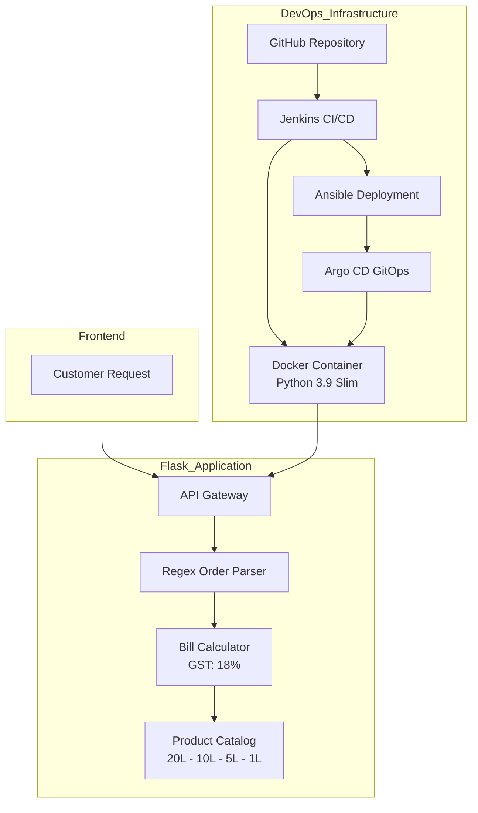
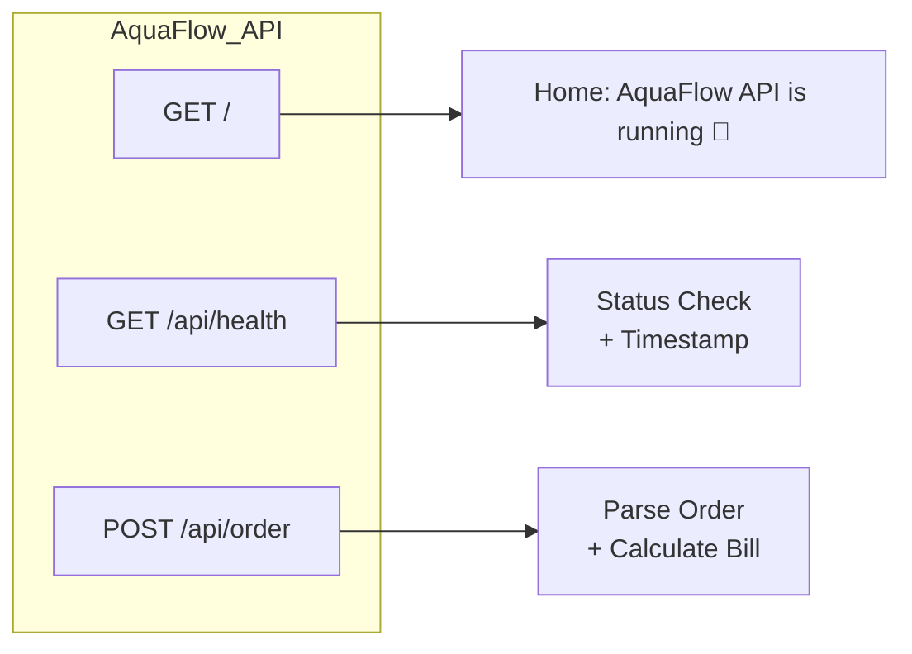
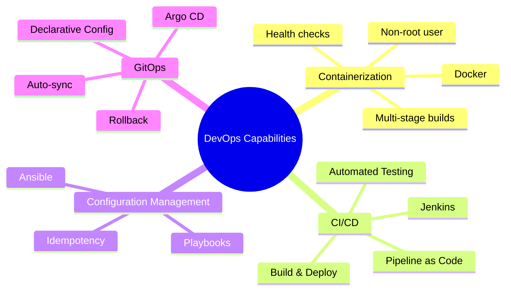

# 🚀 DevOps Project Overview
🚰 AquaFlow Water Delivery Platform
Project Description
AquaFlow is a comprehensive water delivery automation platform that bridges the gap between traditional water supply businesses and modern technology. The platform provides a robust API backend that processes customer orders, manages product catalog, calculates billing with tax and delivery logic, and delivers structured responses—all while being containerized and deployment-ready with industry-standard DevOps practices.

---

## 🏗️ 1️⃣ DevOps Architecture Diagram

---

## 🔌 2️⃣ API Flow Diagram

---

## 🧠 3️⃣ DevOps Capabilities Mindmap

